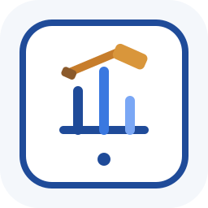

<div align="center">



# Hệ thống Đấu giá Trực tuyến

Ứng dụng đấu giá trực tuyến được xây dựng bằng Java, JavaFX và Java Socket theo mô hình client-server.

<p>
  
  
  
  
</p>

<p>
  <a href="https://drive.google.com/file/d/1uo_7SLGj3uPYg_11qBq5_CuldmiOvQQ0/view?usp=sharing">
    
  </a>
</p>

</div>

---

## 1. Mô tả bài toán và phạm vi hệ thống

Đây là hệ thống đấu giá trực tuyến được xây dựng theo mô hình client-server bằng Java. Hệ thống cho phép nhiều người dùng kết nối đồng thời, đăng nhập theo vai trò, tạo sản phẩm, tạo phiên đấu giá, tham gia trả giá và theo dõi cập nhật theo thời gian thực.

Phạm vi hiện tại của hệ thống bao gồm:

- Giao tiếp giữa client và server qua socket
- Ứng dụng client JavaFX cho người dùng cuối
- Quản lý người dùng theo vai trò `ADMIN`, `SELLER`, `BIDDER`
- Quản lý sản phẩm và phiên đấu giá
- Trả giá thủ công, auto-bid và cập nhật real-time
- Chức năng quản trị như ban/unban người dùng, hủy phiên và nạp tiền

---

## 2. Công nghệ sử dụng

| Hạng mục | Công nghệ |
| --- | --- |
| Ngôn ngữ | Java 17 |
| Công cụ build | Maven Wrapper |
| Giao diện | JavaFX 17 |
| Giao tiếp mạng | Java Socket |
| Xử lý dữ liệu | Java Serialization |
| Thư viện hỗ trợ | Gson |
| Kiểm thử | JUnit 5 |

### Môi trường chạy

- Windows
- Linux
- macOS

### Yêu cầu cài đặt

- Cài đặt JDK 17 và cấu hình `JAVA_HOME`
- Không cần cài Maven riêng vì dự án đã có `mvnw` và `mvnw.cmd`

---

## 3. Cấu trúc thư mục chính

```text
BTL/
├── auction-common/   # Class dùng chung: entity, enum, message, request/response
├── auction-server/   # Server socket, handler, service, repository, scheduler
├── auction-client/   # JavaFX UI, controller, network client
├── data/             # Dữ liệu runtime do server tạo và sử dụng
├── pom.xml           # Parent POM của dự án multi-module
├── mvnw              # Maven wrapper cho Linux/macOS
└── mvnw.cmd          # Maven wrapper cho Windows
```

Lưu ý:

- Thư mục `data/` được tạo tự động khi server chạy lần đầu.
- File `auction_data.dat` cũng được tạo tự động trong quá trình chạy hệ thống.

---

## 4. Hướng dẫn build và chạy chương trình

Tất cả các lệnh dưới đây phải được chạy tại thư mục gốc của project, nơi chứa file `pom.xml`.

### Build toàn bộ dự án

**Windows**

```powershell
.\mvnw.cmd clean install
```

**Linux / macOS**

```bash
./mvnw clean install
```

### Chạy server

**Windows**

```powershell
.\mvnw.cmd -pl auction-server exec:java "-Dexec.mainClass=com.auction.server.AuctionServerApp"
```

**Linux / macOS**

```bash
./mvnw -pl auction-server exec:java -Dexec.mainClass=com.auction.server.AuctionServerApp
```

### Chạy client

**Windows**

```powershell
.\mvnw.cmd -pl auction-client javafx:run
```

**Linux / macOS**

```bash
./mvnw -pl auction-client javafx:run
```

---

## 5. Thứ tự khởi chạy hệ thống

1. Mở terminal tại thư mục gốc của dự án.
2. Build toàn bộ project bằng lệnh `clean install`.
3. Mở terminal thứ nhất và chạy server.
4. Chờ server khởi động xong trên cổng `8080`.
5. Mở terminal thứ hai và chạy client.
6. Nếu muốn mô phỏng nhiều người dùng, mở thêm terminal và chạy thêm client.

Khuyến nghị:

- Luôn chạy server trước rồi mới chạy client.
- Nếu vừa clone dự án về máy, nên build lại toàn bộ trước khi kiểm thử.

### Tài khoản quản trị mặc định

| Trường | Giá trị |
| --- | --- |
| Tên đăng nhập | `admin` |
| Mật khẩu | `Admin@123` |

---

## 6. Danh sách chức năng đã hoàn thành

- Đăng ký tài khoản
- Đăng nhập hệ thống
- Phân quyền theo vai trò người dùng
- Tạo sản phẩm
- Tạo phiên đấu giá
- Xem danh sách phiên đấu giá
- Xem chi tiết phiên đấu giá
- Đặt giá thủ công
- Đăng ký và gỡ auto-bid
- Cập nhật giá và trạng thái phiên theo thời gian thực
- Dashboard cho người bán
- Dashboard cho quản trị viên
- Ban người dùng
- Unban người dùng
- Hủy phiên đấu giá
- Nạp tiền cho người dùng
- Theo dõi số dư
- Lưu trữ và đọc dữ liệu hệ thống

---

## 7. Tài liệu nộp kèm

| Tài liệu | Liên kết |
| --- | --- |
| Báo cáo dự án PDF | [](https://drive.google.com/file/d/1uo_7SLGj3uPYg_11qBq5_CuldmiOvQQ0/view?usp=sharing) |
| Video demo | [](https://drive.google.com/file/d/1H58l96fmdCDdTeT1ZaU3jqpBJBZ3wBSR/view?usp=sharing) |
