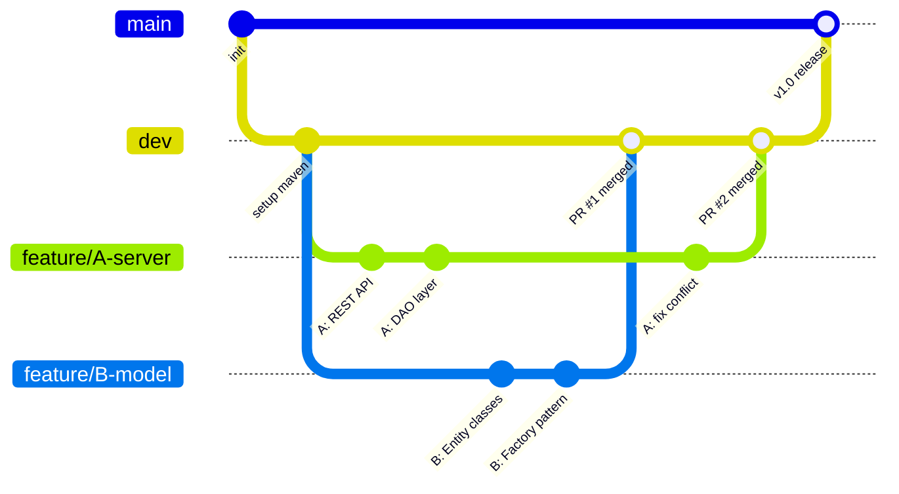

# Git Strategy - Hướng dẫn cho nhóm 4 người (Beginner)

> [!TIP]
> Guide này dành cho sinh viên mới dùng Git. Mỗi bước đều có lệnh copy-paste được.

---

## 1. Mô hình nhánh (đơn giản nhất)



Chỉ cần **3 loại nhánh**:

| Nhánh | Mục đích | Ai động? |
|-------|----------|----------|
| `main` | Code ổn định, chỉ merge khi hoàn thành milestone | Chỉ Người A merge |
| `dev` | Nhánh phát triển chung, mọi người merge vào đây | Cả nhóm (qua PR) |
| `feature/X-mota` | Nhánh riêng mỗi người làm việc | Người sở hữu |

---

## 2. Đặt tên nhánh

```
feature/A-setup-server       ← Người A làm server
feature/B-entity-classes     ← Người B làm model
feature/C-login-screen       ← Người C làm UI
feature/D-user-auth          ← Người D làm features
```

**Quy tắc**: `feature/<tên người>-<mô tả ngắn>` — không dấu tiếng Việt, dùng dấu gạch ngang.

---

## 3. Workflow hàng ngày (copy-paste)

### 🟢 Bắt đầu ngày mới (cập nhật code mới nhất)
```bash
git checkout dev
git pull origin dev

git checkout feature/A-ten-task
git rebase dev
# Nếu conflict → sửa → git add . → git rebase --continue
```

### 🔵 Làm xong 1 phần → commit
```bash
git add .
git commit -m "feat(server): thêm REST API cho User CRUD"
```

### 🟡 Cuối ngày → push lên GitHub
```bash
git push origin feature/A-ten-task --force-with-lease
```

### 🔴 Xong task → tạo Pull Request
Trước khi tạo **Pull Reqeust** : 
```
git checkout feature/A-ten-task
git rebase dev
git push --force-with-lease
```
1. Vào GitHub → **Pull Requests** → **New Pull Request**
2. Base: `dev` ← Compare: `feature/A-ten-task`
3. Viết mô tả ngắn: "Thêm REST API User CRUD"
4. Assign **Người A (Đạt)** review
5. Sau khi approve → **Merge** → **Delete branch**

---

## 4. Commit message (Conventional Commits)

```
<loại>(<phạm vi>): <mô tả ngắn>
```

| Loại | Khi nào dùng | Ví dụ |
|------|-------------|-------|
| `feat` | Thêm tính năng mới | `feat(auction): thêm logic đặt giá` |
| `fix` | Sửa bug | `fix(dao): sửa lỗi query null` |
| `refactor` | Tái cấu trúc, không đổi tính năng | `refactor(entity): tách class Item` |
| `test` | Thêm/sửa test | `test(bid): thêm test concurrent bid` |
| `docs` | Cập nhật tài liệu | `docs: cập nhật README` |
| `style` | Format code, không đổi logic | `style: format theo Google Style` |
| `chore` | Config, build, CI | `chore: thêm GitHub Actions` |

> [!IMPORTANT]
> **Commit thường xuyên, mỗi commit nhỏ!** Đề bài yêu cầu "commit thường xuyên", không chấp nhận 1 commit cuối kỳ.
> Mục tiêu: **ít nhất 2-3 commit/ngày** khi đang code.

---

## 5. Setup ban đầu (Người A làm 1 lần)

```bash
# 1. Tạo repo trên GitHub (tên: online-auction-system)

# 2. Clone về máy
git clone https://github.com/<username>/online-auction-system.git
cd online-auction-system

# 3. Tạo nhánh dev
git checkout -b dev
git push -u origin dev

# 4. Bật Branch Protection trên GitHub:
#    Settings → Branches → Add rule
#    Branch name: "main"
#    ☑ Require pull request before merging
#    ☑ Require approvals (1)
```

### Các thành viên khác clone:
```bash
git clone https://github.com/duydat1412/BTL.git
cd BTL
git checkout dev
git checkout -b feature/B-entity-classes  # đổi tên theo task
```

---

## 6. Xử lý Conflict (đừng hoảng!)

Conflict xảy ra khi 2 người sửa cùng 1 file → Git không biết giữ code nào.

```bash
# Khi merge dev vào nhánh mình mà bị conflict:
git merge dev
# Git báo: CONFLICT in src/server/service/AuctionService.java

# Mở file bị conflict, tìm đoạn:
<<<<<<< HEAD
    // Code của bạn
=======
    // Code từ dev
>>>>>>> dev

# Giữ code đúng, xóa <<<, ===, >>> rồi:
git add .
git commit -m "fix: resolve merge conflict"
```

> [!CAUTION]
> **KHÔNG BAO GIỜ** dùng `git push --force` trên nhánh `dev` hoặc `main`.
> Nếu bị lỗi khi push → `git pull` trước rồi push lại.

---

## 7. Quy tắc nhóm

| Quy tắc | Lý do |
|---------|-------|
| ❌ Không commit trực tiếp vào `main` hay `dev` | Tránh phá code người khác |
| ✅ Luôn tạo Pull Request để merge | Người A review trước khi merge |
| ✅ Pull `dev` về trước khi bắt đầu code | Tránh conflict lớn |
| ✅ Mỗi feature branch chỉ 1 người sở hữu | Tránh sửa chồng |
| ✅ Commit sau mỗi 30-60 phút code | Đề bài yêu cầu commit thường xuyên |
| ❌ Không push code bị lỗi compile | Test `mvn compile` trước khi push |

---

## 8. Lệnh cứu mạng

| Tình huống | Lệnh |
|-----------|------|
| Commit nhầm, muốn sửa message | `git commit --amend -m "message mới"` |
| Đã `git add` nhưng muốn bỏ | `git reset HEAD <file>` |
| Muốn xem đang ở nhánh nào | `git branch` |
| Muốn xem lịch sử commit | `git log --oneline -10` |
| Muốn hủy thay đổi chưa commit | `git checkout -- <file>` |
| Muốn lưu tạm code dở (chuyển nhánh) | `git stash` → làm xong → `git stash pop` |

---

## 9. Milestone merge vào main

Khi hoàn thành 1 giai đoạn lớn (cuối tuần 3, 5, 7...):

```bash
# Người A làm:
git checkout main
git merge dev
git tag v1.0   # hoặc v2.0, v3.0...
git push origin main --tags
```
