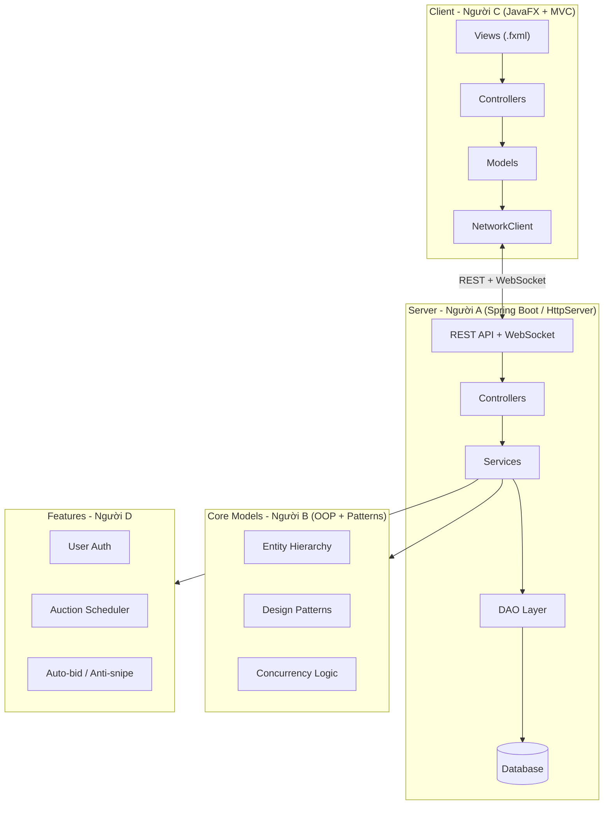

# Hệ thống Đấu giá Trực tuyến - Implementation Plan

Bài tập lớn Lập trình Nâng cao - Java OOP Client-Server Auction System.  
Nhóm 4 người: **A (Team Lead & Server)**, **B (OOP & Data Model)**, **C (Client UI/UX)**, **D (Features & QA)**.

---

## Kiến trúc tổng quan



---

## Phân công chi tiết theo vai trò

### Người A — Team Lead & Server Core

**Phạm vi**: Kiến trúc hệ thống, Server + REST API, Database + DAO, Auction logic, CI/CD setup, Code review

| # | Task | Files/Packages | Tuần |
|---|------|---------------|------|
| 1 | Setup GitHub repo, Maven multi-module (`common`, `server`, `client`) | `pom.xml`, `.gitignore`, `README.md` | 1 |
| 2 | Áp dụng **Google Java Style Guide** + **Conventional Commits** | Toàn project | 1 (liên tục) |
| 3 | Cấu hình Server (Spring Boot hoặc `com.sun.net.httpserver`) | `server/` module | 1 |
| 4 | REST API endpoints: User CRUD, Item CRUD, Auction CRUD, Bid | `server/controller/` | 2-3 |
| 5 | WebSocket endpoint cho realtime bid updates | `server/websocket/` | 4-5 |
| 6 | Database config + connection pool (H2/SQLite) | `server/db/DatabaseManager.java` (**Singleton**) | 2 |
| 7 | DAO layer: `UserDAO`, `ItemDAO`, `AuctionDAO`, `BidDAO` | `server/dao/` | 2-3 |
| 8 | Auction logic: tích hợp Service layer với DAO | `server/service/` | 4-5 |
| 9 | **CI/CD**: GitHub Actions + JUnit test tự động | `.github/workflows/` | 6 |
| 10 | Review PR, merge code, kiểm soát chất lượng | GitHub | Liên tục |

---

### Người B — OOP & Data Model

**Phạm vi**: Class hierarchy, Design Patterns, Concurrency, Unit Tests

| # | Task | Files/Packages | Tuần |
|---|------|---------------|------|
| 1 | Entity hierarchy: `Entity` (abstract) → `User` (abstract) → `Bidder`, `Seller`, `Admin` | `common/entity/` | 1-2 |
| 2 | Item hierarchy: `Item` (abstract) → `Electronics`, `Art`, `Vehicle` | `common/entity/` | 1-2 |
| 3 | `Auction`, `BidTransaction`, `AutoBid` classes | `common/entity/` | 2 |
| 4 | **Encapsulation**: `private` fields + getter/setter toàn bộ entity | `common/entity/` | 1-2 |
| 5 | **Polymorphism**: override `getInfo()` / `toString()` ở mỗi subclass | `common/entity/` | 2 |
| 6 | **Abstraction**: abstract methods trong `Entity`, `User`, `Item` | `common/entity/` | 1-2 |
| 7 | **Factory Method**: `ItemFactory` tạo Item theo type | `common/factory/` | 2 |
| 8 | **Observer Pattern**: `AuctionObserver` interface + `AuctionEventManager` | `server/observer/` | 4 |
| 9 | **Strategy Pattern**: `BidStrategy` interface → `ManualBidStrategy`, `AutoBidStrategy` | `common/strategy/` | 4-5 |
| 10 | **Singleton**: Áp dụng cho DatabaseManager, AuctionManager | Phối hợp Người A | 3 |
| 11 | **Concurrency**: `synchronized` / `ReentrantLock` cho `BidService.placeBid()` | `server/service/BidService.java` | 4-5 |
| 12 | Enums: `AuctionStatus`, `UserRole`, `ItemType` | `common/enums/` | 1 |
| 13 | **JUnit Tests**: UserService, BidService, AuctionService, ItemFactory, Concurrency | `server/src/test/` | 6 |

---

### Người C — Client & UI/UX

**Phạm vi**: JavaFX screens, FXML layouts, Client MVC, Bidding screen, Realtime update UI, Error handling UI

| # | Task | Files/Packages | Tuần |
|---|------|---------------|------|
| 1 | Setup JavaFX module, Scene Builder | `client/` module | 1 |
| 2 | Login / Register screen | `view/login.fxml` + `controller/LoginController.java` | 2-3 |
| 3 | Auction List screen (grid/list view) | `view/auction_list.fxml` + controller | 3 |
| 4 | Auction Detail + Realtime Bidding screen | `view/auction_detail.fxml` + controller | 4-5 |
| 5 | Seller Dashboard (CRUD sản phẩm) | `view/seller_dashboard.fxml` + controller | 3-4 |
| 6 | Admin Panel | `view/admin.fxml` + controller | 5 |
| 7 | `NetworkClient` class: gọi REST API + lắng nghe WebSocket | `client/network/` | 4-5 |
| 8 | `Platform.runLater()` cho realtime updates (giá, countdown timer) | Trong các controllers | 5-6 |
| 9 | CSS styling (dark theme / modern look) | `client/css/style.css` | 6 |
| 10 | **Error handling UI**: hiển thị lỗi, thông báo cho người dùng | Trong các controllers | 5-6 |

---

### Người D — Features & QA

**Phạm vi**: User management, Product management, Session end logic, Auto-bidding, Anti-sniping, Bid chart (bonus)

| # | Task | Files/Packages | Tuần |
|---|------|---------------|------|
| 1 | User registration + login logic (password hashing BCrypt) | `server/service/UserService.java` | 2-3 |
| 2 | Product management service (CRUD validation) | `server/service/ItemService.java` | 2-3 |
| 3 | `AuctionScheduler`: `ScheduledExecutorService` tự động đóng phiên | `server/service/AuctionScheduler.java` | 4-5 |
| 4 | Status transitions: `OPEN → RUNNING → FINISHED → PAID / CANCELED` | Trong AuctionService | 4-5 |
| 5 | **Auto-bidding**: maxBid, increment, `PriorityQueue` theo thời gian đăng ký | `server/service/AutoBidService.java` | 7 |
| 6 | **Anti-sniping**: bid trong X giây cuối → gia hạn Y giây | Trong AuctionScheduler | 7 |
| 7 | Exception handling: bid < currentPrice, bid on closed auction, invalid data | Toàn hệ thống | 6 |
| 8 | Edge case testing: concurrent bids, connection loss, invalid inputs | Test cases | 6-8 |
| 9 | **Bid History chart (bonus)**: LineChart giá realtime (trục X: time, Y: price) | `client/controller/` phối hợp Người C | 7 |

---

## Lịch trình 8 tuần

| Tuần | Milestone | Người A | Người B | Người C | Người D |
|------|-----------|---------|---------|---------|---------|
| **1** | Setup & Design | GitHub, Maven, Server scaffold | Entity classes, Enums, class diagram | JavaFX setup, Scene Builder | Nghiên cứu requirements |
| **2-3** | Core CRUD | REST API (User, Item), DAO, DB | Item hierarchy, Factory, Auction model | Login, Auction List UI | User auth, Item service |
| **4-5** | Auction Logic | WebSocket, Bid API, Service integration | Observer, Concurrency (ReentrantLock) | Bidding screen, Seller dashboard | Scheduler, Status transitions |
| **6** | Integration | Tích hợp toàn bộ, fix bugs | JUnit tests | Realtime UI (Platform.runLater) | Exception handling, edge cases |
| **7** | Advanced | Hỗ trợ tích hợp | Hỗ trợ test concurrency | UI polish | Auto-bid, Anti-sniping, Bid chart |
| **8-9** | Final | Code review, documentation | Final tests | UI polish | End-to-end testing |

---

## Cấu trúc thư mục dự kiến

```
*\BTL/
├── pom.xml                          # Parent POM (Maven multi-module)
├── README.md
├── .gitignore
├── auction-common/
│   ├── pom.xml
│   └── src/main/java/com/auction/common/
│       ├── entity/                  # [Người B] User, Item, Auction, BidTransaction
│       ├── enums/                   # [Người B] AuctionStatus, UserRole, ItemType
│       ├── factory/                 # [Người B] ItemFactory
│       └── observer/                # [Người B] AuctionObserver interface
├── auction-server/
│   ├── pom.xml
│   ├── src/main/java/com/auction/server/
│   │   ├── AuctionServerApp.java    # [Người A] Main entry
│   │   ├── config/                  # [Người A] Server config
│   │   ├── db/                      # [Người A] DatabaseManager (Singleton)
│   │   ├── dao/                     # [Người A] UserDAO, ItemDAO, AuctionDAO, BidDAO
│   │   ├── controller/              # [Người A] REST controllers
│   │   ├── websocket/               # [Người A] WebSocket handler
│   │   ├── service/                 # [Người A + B + D]
│   │   │   ├── AuctionService.java
│   │   │   ├── BidService.java      # [Người B] Concurrency logic
│   │   │   ├── UserService.java     # [Người D] Auth logic
│   │   │   ├── AutoBidService.java  # [Người D] Auto-bid
│   │   │   └── AuctionScheduler.java# [Người D] Scheduler + Anti-snipe
│   │   └── observer/                # [Người B] AuctionEventManager
│   └── src/test/java/               # [Người B + D] JUnit tests
└── auction-client/
    ├── pom.xml
    └── src/main/
        ├── java/com/auction/client/
        │   ├── AuctionClientApp.java# [Người C] JavaFX main
        │   ├── controller/          # [Người C] FX Controllers
        │   ├── model/               # [Người C] Client-side models
        │   └── network/             # [Người C] REST client + WebSocket listener
        └── resources/
            ├── view/                # [Người C] FXML files
            └── css/                 # [Người C] Stylesheets
```

---

## Verification Plan

### Manual Testing
1. Start server → Start 2+ clients → Test full auction flow
2. Verify realtime updates across clients
3. Test concurrent bidding (2 bidders same time)
4. Test auto-bid + anti-sniping
5. Test edge cases (invalid bid, closed auction, connection loss)
