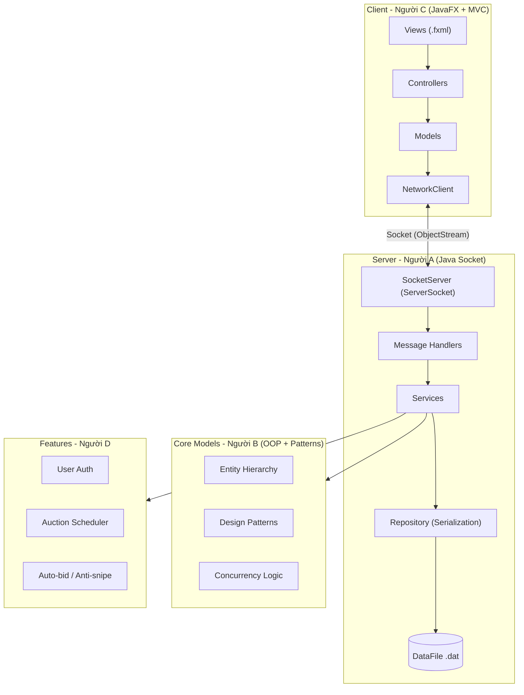

# Hệ thống Đấu giá Trực tuyến - Implementation Plan

Bài tập lớn Lập trình Nâng cao - Java OOP Client-Server Auction System.  
Nhóm 4 người: **A (Team Lead & Server)**, **B (OOP & Data Model)**, **C (Client UI/UX)**, **D (Features & QA)**.

---

## Kiến trúc tổng quan



---

## Phân công chi tiết theo vai trò

### Người A — Team Lead & Server Core

**Phạm vi**: Kiến trúc hệ thống, Server Socket, Repository (Serialization), Auction logic, CI/CD setup, Code review

| # | Task | Files/Packages | Tuần |
|---|------|---------------|------|
| 1 | Setup GitHub repo, Maven multi-module (`common`, `server`, `client`) | `pom.xml`, `.gitignore`, `README.md` | 6 |
| 2 | Áp dụng **Google Java Style Guide** + **Conventional Commits** | Toàn project | 6 (liên tục) |
| 3 | Cấu hình Server: `ServerSocket` lắng nghe nhiều client, mỗi client 1 Thread | `server/` module | 6 |
| 4 | Socket message handlers: User, Item, Auction, Bid | `server/handler/` | 7-8 |
| 5 | Realtime update qua Socket + Observer Pattern | `server/observer/` | 7-8 |
| 6 | DataStore (Serialization-based): `ObjectOutputStream / ObjectInputStream` | `server/datastore/DataStore.java` (**Singleton**) | 7 |
| 7 | Repository layer: `UserRepository`, `ItemRepository`, `AuctionRepository`, `BidRepository` (Serialization) | `server/repository/` | 7-8 |
| 8 | Auction logic: tích hợp Service layer với Repository | `server/service/` | 8-9 |
| 9 | **Tích hợp Checkstyle plugin** vào `pom.xml` — Enforce **Google Java Style** tự động khi build | `pom.xml` | 9 |
| 10 | **CI/CD**: GitHub Actions + JUnit test tự động | `.github/workflows/` | 9 |
| 11 | Review PR, merge code, kiểm soát chất lượng | GitHub | Liên tục |
| 12 | **README.md**: Viết README đầy đủ — hướng dẫn cài đặt, cách chạy Server, cách chạy Client | `README.md` | 13-14 |

---

### Người B — OOP & Data Model

**Phạm vi**: Class hierarchy, Design Patterns, Concurrency, Unit Tests

| # | Task | Files/Packages | Tuần |
|---|------|---------------|------|
| 1 | Entity hierarchy: `Entity` (abstract) → `User` (abstract) → `Bidder`, `Seller`, `Admin` | `common/entity/` | 6-7 |
| 2 | Item hierarchy: `Item` (abstract) → `Electronics`, `Art`, `Vehicle` | `common/entity/` | 6-7 |
| 3 | `Auction`, `BidTransaction`, `AutoBid` classes | `common/entity/` | 7 |
| 4 | **Encapsulation**: `private` fields + getter/setter toàn bộ entity | `common/entity/` | 6-7 |
| 5 | **Polymorphism**: override `getInfo()` / `toString()` ở mỗi subclass | `common/entity/` | 7 |
| 6 | **Abstraction**: abstract methods trong `Entity`, `User`, `Item` | `common/entity/` | 6-7 |
| 7 | **Factory Method**: `ItemFactory` tạo Item theo type | `common/factory/` | 6 |
| 8 | ⚠️ **Observer Pattern**: `AuctionObserver` interface + `AuctionEventManager` — **ƯU TIÊN CAO: hoàn thành trong Tuần 7** | `server/observer/` | 7 |
| 9 | **Strategy Pattern**: `BidStrategy` interface → `ManualBidStrategy`, `AutoBidStrategy` | `common/strategy/` | 8 |
| 10 | **Singleton**: Áp dụng cho DataStore, AuctionManager | Phối hợp Người A | 7 |
| 11 | **Concurrency**: `synchronized` / `ReentrantLock` cho `BidService.placeBid()` | `server/service/BidService.java` | 7-8 |
| 12 | Enums: `AuctionStatus`, `UserRole`, `ItemType` | `common/enums/` | 6 |
| 13 | **JUnit Tests**: UserService, BidService, AuctionService, ItemFactory, Concurrency | `server/src/test/` | 8 |
| 14 | **Unit test coverage ≥ 60%** — Dùng **JaCoCo plugin** để đo coverage | `pom.xml` + `server/src/test/` | 10 |

---

### Người C — Client & UI/UX

**Phạm vi**: JavaFX screens, FXML layouts, Client MVC, Bidding screen, Realtime update UI, Error handling UI

| # | Task | Files/Packages | Tuần |
|---|------|---------------|------|
| 1 | Setup JavaFX module, Scene Builder | `client/` module | 6 |
| 2 | Login / Register screen | `view/login.fxml` + `controller/LoginController.java` | 7-8 |
| 3 | Auction List screen (grid/list view) | `view/auction_list.fxml` + controller | 8 |
| 4 | Auction Detail + Realtime Bidding screen | `view/auction_detail.fxml` + controller | 8-9 |
| 5 | Seller Dashboard (CRUD sản phẩm) | `view/seller_dashboard.fxml` + controller | 8-9 |
| 6 | Admin Panel | `view/admin.fxml` + controller | 9-10 |
| 7 | `NetworkClient` class: dùng `Socket` + `ObjectOutputStream` để gửi request, `ObjectInputStream` để nhận response | `client/network/` | 9-10 |
| 8 | `Platform.runLater()` cho realtime updates (giá, countdown timer) | Trong các controllers | 10 |
| 9 | CSS styling (dark theme / modern look) | `client/css/style.css` | 10-11 |
| 10 | **Error handling UI**: hiển thị lỗi, thông báo cho người dùng | Trong các controllers | 10-11 |

---

### Người D — Features & QA

**Phạm vi**: User management, Product management, Session end logic, Auto-bidding, Anti-sniping, Bid chart (bonus), Custom Exceptions

| # | Task | Files/Packages | Tuần |
|---|------|---------------|------|
| 1 | User registration + login logic (password hashing BCrypt) | `server/service/UserService.java` | 7-8 |
| 2 | Product management service (CRUD validation) | `server/service/ItemService.java` | 7-8 |
| 3 | **Custom Exceptions**: `InvalidBidException`, `AuctionClosedException`, `AuthenticationException` | `server/exception/` | 8 |
| 4 | `AuctionScheduler`: `ScheduledExecutorService` tự động đóng phiên | `server/service/AuctionScheduler.java` | 8-9 |
| 5 | Status transitions: `OPEN → RUNNING → FINISHED → PAID / CANCELED` | Trong AuctionService | 8-9 |
| 6 | Exception handling: bid < currentPrice, bid on closed auction, invalid data | Toàn hệ thống | 9-10 |
| 7 | Edge case testing: concurrent bids, connection loss, invalid inputs | Test cases | 9-11 |
| 8 | **Unit test coverage ≥ 60%** — Phối hợp Người B, dùng **JaCoCo plugin** | `server/src/test/` | 10 |
| 9 | **Auto-bidding**: maxBid, increment, `PriorityQueue` theo thời gian đăng ký | `server/service/AutoBidService.java` | 13-14 |
| 10 | **Anti-sniping**: bid trong X giây cuối → gia hạn Y giây | Trong AuctionScheduler | 13-14 |
| 11 | **Bid History chart (bonus)**: LineChart giá realtime (trục X: time, Y: price) | `client/controller/` phối hợp Người C | 13-14 |

---

## Lịch trình 9 tuần (Tuần 6 → Tuần 15)

| Tuần | Milestone | Người A | Người B | Người C | Người D |
|------|-----------|---------|---------|---------|---------|
| **6** | Khởi động + Thiết kế OOP | GitHub, Maven, Server scaffold (ServerSocket) | Entity classes, Enums, class diagram, Factory | JavaFX setup, Scene Builder, tự học JavaFX + SceneBuilder | Nghiên cứu requirements |
| **7** | Observer + Logic đấu giá + GUI cơ bản | Socket message handlers, DataStore (Serialization) | ⚠️ **Observer Pattern (ƯU TIÊN CAO)**, Concurrency (ReentrantLock) | Login, Auction List UI | User auth, Item service |
| **8** | Custom Exceptions + JUnit + Refactor SOLID + GUI MVC | Repository layer, Service integration | JUnit tests, Strategy Pattern | Bidding screen, Seller dashboard | Custom Exceptions, Scheduler, Status transitions |
| **9** | Maven + Checkstyle + GitHub Actions + Socket + Serialization | Checkstyle plugin, CI/CD (GitHub Actions), tự học Socket server-side & Serialization | Hỗ trợ refactor SOLID | NetworkClient (Socket), tự học Socket client-side | Exception handling |
| **10** | Client-Server hoàn thiện + GUI đầy đủ + Coverage ≥60% | Tích hợp toàn bộ, fix bugs | Unit test coverage ≥60% (JaCoCo) | Realtime UI (Platform.runLater), Admin panel | Unit test coverage ≥60% (JaCoCo), edge case testing |
| **11-12** | Tích hợp toàn bộ + E2E testing + Fix bugs | Hỗ trợ tích hợp, code review | Hỗ trợ test concurrency | CSS styling, UI polish | End-to-end testing |
| **13-14** | Polish UI + Auto-bid + Anti-sniping + Bid chart (nếu kịp) | README.md đầy đủ | Final tests | UI polish | Auto-bid, Anti-sniping, Bid chart |
| **15** | Trình bày + Demo + Chấm điểm | Trình bày | Trình bày | Demo | Demo |

---

## Cấu trúc thư mục dự kiến

```
*\BTL/
├── pom.xml                          # Parent POM (Maven multi-module) + Checkstyle plugin
├── README.md                        # Hướng dẫn cài đặt, chạy Server, chạy Client
├── .gitignore
├── auction-common/
│   ├── pom.xml
│   └── src/main/java/com/auction/common/
│       ├── entity/                  # [Người B] User, Item, Auction, BidTransaction
│       ├── enums/                   # [Người B] AuctionStatus, UserRole, ItemType
│       ├── factory/                 # [Người B] ItemFactory
│       ├── observer/                # [Người B] AuctionObserver interface
│       └── strategy/                # [Người B] BidStrategy, AutoBidStrategy
├── auction-server/
│   ├── pom.xml
│   ├── src/main/java/com/auction/server/
│   │   ├── AuctionServerApp.java    # [Người A] Main entry (ServerSocket)
│   │   ├── datastore/               # [Người A] DataStore (Singleton, Serialization)
│   │   ├── repository/              # [Người A] UserRepository, ItemRepository, AuctionRepository, BidRepository
│   │   ├── handler/                 # [Người A] Socket message handlers
│   │   ├── service/                 # [Người A + B + D]
│   │   │   ├── AuctionService.java
│   │   │   ├── BidService.java      # [Người B] Concurrency logic
│   │   │   ├── UserService.java     # [Người D] Auth logic
│   │   │   ├── AutoBidService.java  # [Người D] Auto-bid
│   │   │   └── AuctionScheduler.java# [Người D] Scheduler + Anti-snipe
│   │   ├── observer/                # [Người B] AuctionEventManager
│   │   └── exception/               # [Người D] Custom Exceptions
│   │       ├── InvalidBidException.java
│   │       ├── AuctionClosedException.java
│   │       └── AuthenticationException.java
│   └── src/test/java/               # [Người B + D] JUnit tests (coverage ≥ 60%, JaCoCo)
│       └── data/                    # .dat files (Serialization data)
└── auction-client/
    ├── pom.xml
    └── src/main/
        ├── java/com/auction/client/
        │   ├── AuctionClientApp.java# [Người C] JavaFX main
        │   ├── controller/          # [Người C] FX Controllers
        │   ├── model/               # [Người C] Client-side models
        │   └── network/             # [Người C] Socket client (ObjectStream)
        └── resources/
            ├── view/                # [Người C] FXML files
            └── css/                 # [Người C] Stylesheets
```

---

## Verification Plan

### Manual Testing
1. Start server → Start 2+ clients → Test full auction flow
2. Verify realtime updates across clients (qua Socket)
3. Test concurrent bidding (2 bidders same time)
4. Test auto-bid + anti-sniping
5. Test edge cases (invalid bid, closed auction, connection loss)

### Automated Testing
- Unit test coverage ≥ 60% (đo bằng JaCoCo)
- GitHub Actions chạy `mvn clean test` + Checkstyle tự động
