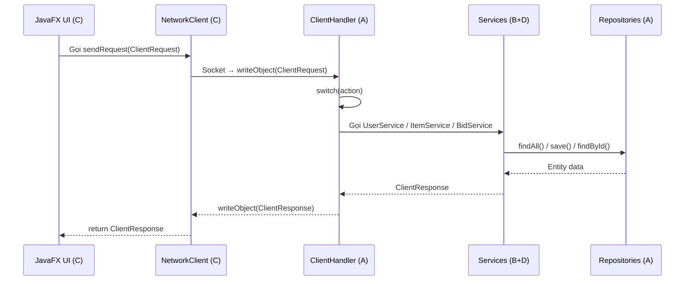

# 📊 Báo cáo Tiến độ Dự án — Tuần 10 (06/05/2026)

> **Thời điểm kiểm tra**: 06/05/2026, 10:15 AM
> **Nhánh dev**: Đã merge tất cả nhánh feature → build **SUCCESS** toàn bộ 4 modules.

---

## 🔄 Workflow Hiện tại

```mermaid
graph LR
    A["feature/A-server"] -->|merged| DEV["dev"]
    B["feature/B-model"] -->|merged| DEV
    C["feature/C-login-screen"] -->|merged (conflict resolved)| DEV
    D["feature/D-user-auth"] -->|merged| DEV
    DEV -->|"PR (chưa merge)"| MAIN["main"]
```

**Luồng giao tiếp Client ↔ Server hiện tại:**



---

## 🟦 Người B — OOP & Data Model

### Đã hoàn thành
| Task | File | Đánh giá |
|------|------|----------|
| ✅ Strategy Pattern | `BidStrategy.java`, `ManualBidStrategy.java`, `AutoBidStrategy.java` | **Xuất sắc** — Javadoc đầy đủ, logic rõ ràng |
| ✅ BidService + Concurrency | `BidService.java` (156 dòng) | **Xuất sắc** — `ReentrantLock` per auction, DI qua constructor |
| ✅ Unit Tests (5 files, 942 dòng) | `BidServiceTest`, `BidServiceConcurrencyTest`, `StrategyTest`, `ItemFactoryTest`, `AuctionEventManagerTest` | **Xuất sắc** — Stub repositories, test edge cases |

### Code Review chi tiết

**`BidService.java`** ⭐⭐⭐⭐⭐
- ✅ `ConcurrentHashMap<String, ReentrantLock>` — fine-grained locking đúng chuẩn
- ✅ `lock.unlock()` trong `finally` — tránh deadlock
- ✅ DI qua constructor (Dependency Inversion Principle)
- ✅ Tích hợp Strategy Pattern + Observer Pattern
- ✅ Custom exceptions (`AuctionClosedException`, `InvalidBidException`)

**`BidServiceTest.java`** ⭐⭐⭐⭐⭐
- ✅ 7 test cases cover happy path + error cases
- ✅ Dùng Stub repositories (không phụ thuộc file I/O)
- ✅ Test observer notification
- ✅ `@DisplayName` tiếng Việt dễ đọc

### Còn lại
| Task | Trạng thái | Ghi chú |
|------|------------|---------|
| ⬜ SOLID Refactor | Chưa làm | Tuần 9 theo plan |
| ⬜ JaCoCo Coverage ≥ 60% | Chưa cấu hình | Cần thêm plugin vào pom.xml |

---

## 🟩 Người C — Client UI/UX

### Đã hoàn thành
| Task | File | Đánh giá |
|------|------|----------|
| ✅ NetworkClient | `NetworkClient.java` (69 dòng) | **Tốt** — Singleton, kết nối Socket đúng |
| ✅ Login/Register | `LoginController.java` + `login.fxml` | **Khá** — Kết nối server thật, validate input |
| ✅ Auction List | `AuctionListController.java` + `auction_list.fxml` | **Khá** — ListView + navigate sang Detail |
| ✅ Auction Detail | `AuctionDetailController.java` + `auction_detail.fxml` | ⚠️ Skeleton — chưa gọi server |
| ⚠️ Seller Dashboard | `SellerDashboardController.java` + `seller_dashboard.fxml` | ⚠️ Skeleton — chỉ print console |
| ⚠️ Admin Panel | `AdminController.java` + `admin.fxml` | ❌ Class rỗng (5 dòng) |

### Code Review chi tiết

**`NetworkClient.java`** ⭐⭐⭐⭐
- ✅ Singleton pattern
- ✅ Kiểm tra `socket.isConnected()` trước khi tạo mới
- ✅ Hàm `sendRequest()` generic — tất cả controller đều dùng được
- ⚠️ Thiếu method `disconnect()` — không đóng socket khi thoát app
- ⚠️ Singleton không thread-safe (`if (instance == null)` không synchronized)

**`LoginController.java`** ⭐⭐⭐
- ✅ Đã kết nối server thật qua NetworkClient
- ✅ Validate input rỗng
- ⚠️ Register dùng `new RegisterRequest(user, pass, user, null)` — email = username, role = null → sẽ lỗi phía server
- ❌ Login thành công nhưng **KHÔNG navigate** sang Auction List → user bị kẹt ở màn login

**`AuctionListController.java`** ⭐⭐⭐
- ✅ ListView có custom CellFactory hiển thị title + giá
- ✅ Click vào item → navigate sang Detail
- ❌ **KHÔNG gọi server** để lấy danh sách Auction → ListView luôn trống rỗng
- ❌ Thiếu method `loadAuctions()` gọi `GET_AUCTIONS`

**`AuctionDetailController.java`** ⭐⭐
- ✅ Hiển thị title, giá từ Auction object
- ❌ `handlePlaceBid()` chỉ `System.out.println()` — chưa gọi `PLACE_BID`
- ❌ Chưa có countdown timer
- ❌ Chưa có bid history

**`SellerDashboardController.java`** ⭐
- ❌ `handleAddProduct()` chỉ print console — chưa gọi `CREATE_ITEM`
- ❌ Chưa load danh sách sản phẩm
- ❌ Chưa có chức năng sửa/xóa

**`AdminController.java`** ❌
- Class hoàn toàn rỗng (5 dòng)

### Vấn đề pom.xml nghiêm trọng (đã sửa)
Người C đã **xóa mất `<parent>` tag** và đổi sang Java 21 + JavaFX 21 → phá vỡ cấu trúc multi-module. Đã resolve conflict khi merge.

---

## 🟧 Người D — Features & QA

### Đã hoàn thành
| Task | File | Đánh giá |
|------|------|----------|
| ✅ UserService (Login/Register) | `UserService.java` | **Tốt** — BCrypt hash, validate |
| ✅ Custom Exceptions | `AuthenticationException`, `InvalidBidException`, `AuctionClosedException` | **Tốt** |
| ✅ ItemService CREATE | `ItemService.java` (đã được A rewrite) | **Tốt** — sau khi sửa |
| ✅ ItemService READ | `ItemService.java` (đã được A rewrite) | **Tốt** — sau khi sửa |

### Còn lại
| Task | Trạng thái | Ghi chú |
|------|------------|---------|
| ⬜ ItemService UPDATE | Chưa làm | Method rỗng |
| ⬜ ItemService DELETE | Chưa làm | Method rỗng |
| ⬜ AuctionScheduler | Chưa làm | ScheduledExecutorService |
| ⬜ Status Transitions | Chưa làm | OPEN → RUNNING → FINISHED |
| ⬜ Unit Tests cho edge cases | Chưa làm | |

---

## ⚠️ Nút thắt cổ chai (Blockers)

### 1. ClientHandler chưa kết nối Services

> [!CAUTION]
> **`ClientHandler.java` vẫn còn 9 action trả về `pending()`!**

```java
case PLACE_BID -> pending(action, "BidService integration");
case GET_ITEMS -> pending(action, "ItemService integration");
case CREATE_ITEM -> pending(action, "ItemService integration");
// ... tất cả đều pending
```

Người B đã viết xong `BidService`, người D (+ A sửa) đã viết xong `ItemService.createItem()` và `ItemService.getItems()`, nhưng **chưa ai kết nối chúng vào `ClientHandler`**. Điều này có nghĩa là:
- Client gửi `PLACE_BID` → server trả về `"PLACE_BID pending: BidService integration"` → client không đặt giá được
- Client gửi `GET_ITEMS` → server trả về `"GET_ITEMS pending: ItemService integration"` → danh sách luôn trống

**→ Đây là việc của Người A (bạn) cần làm ngay.**

### 2. Client UI chưa kết nối đầy đủ
- Login thành công nhưng không chuyển màn hình
- Auction List không gọi server → luôn trống
- Bid / Create Item chỉ print console

---

## 📅 Đề xuất ưu tiên tiếp theo

| Ưu tiên | Người | Task | Lý do |
|---------|-------|------|-------|
| 🔴 1 | **A** | Kết nối `ClientHandler` với `BidService` + `ItemService` | Unblock toàn bộ flow |
| 🔴 2 | **C** | Login → navigate sang Auction List | User bị kẹt ở màn login |
| 🔴 3 | **C** | Auction List gọi `GET_AUCTIONS` từ server | ListView luôn trống |
| 🟡 4 | **D** | Hoàn thành ItemService UPDATE + DELETE | Seller Dashboard cần |
| 🟡 5 | **C** | AuctionDetail gọi `PLACE_BID` thực | Chức năng cốt lõi |
| 🟡 6 | **B** | Cấu hình JaCoCo plugin | Yêu cầu coverage ≥ 60% |
| 🟢 7 | **C** | CSS Styling + Error handling | Polish UI |
