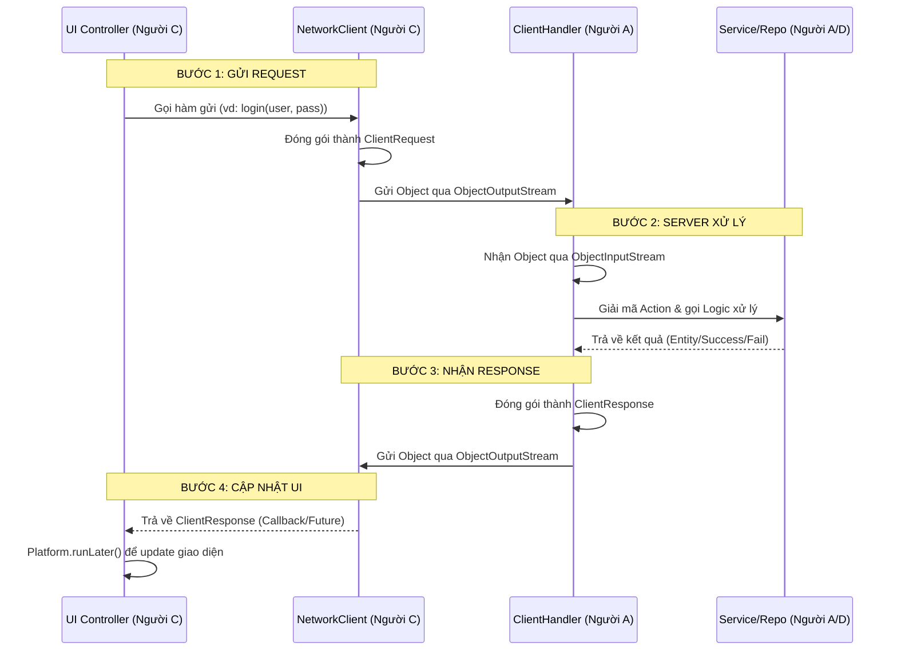

# Chi tiết Quy trình Xử lý Request - Response (Dành cho Người C)

Tài liệu này giải thích cách hệ thống truyền tải và xử lý dữ liệu giữa Client (Giao diện) và Server (Logic/Database) thông qua Socket.

---

## 1. Sơ đồ Workflow tổng quát



---

## 2. Chi tiết các bước thực hiện

### Bước 1: Người C khởi tạo Request
Khi người dùng nhấn một nút (ví dụ: Đăng nhập), Controller sẽ thu thập dữ liệu và gọi `NetworkClient`.
- **Dữ liệu dùng chung:** `ClientRequest` (từ module `common`).
- **Cấu trúc:** `new ClientRequest(Action.LOGIN, loginRequestPayload)`.

### Bước 2: Server (Handler) tiếp nhận và điều hướng
Phần này do **Người A** viết, nhưng **Người C** cần hiểu để biết dữ liệu mình nhận lại từ đâu:
1. `ClientHandler` chạy trong một Thread riêng cho mỗi Client.
2. Nó dùng `readObject()` để đợi lệnh từ bạn.
3. Dựa vào `Action` trong request, nó sẽ gọi Service tương ứng (ví dụ: `UserService.login()`).

### Bước 3: Server phản hồi (Response)
Server LUÔN LUÔN trả về một đối tượng `ClientResponse` để đảm bảo tính thống nhất:
- `success`: `true/false` (thành công hay thất bại).
- `message`: Thông báo lỗi hoặc xác nhận (để hiển thị lên Alert).
- `data`: Đối tượng dữ liệu (ví dụ: thông tin User sau khi login, hoặc danh sách Auction).

### Bước 4: Người C xử lý Response cuối cùng
Đây là phần quan trọng nhất của **Người C**. Vì Socket thường chạy trên một Thread riêng để tránh treo máy (Non-blocking), bạn cần đưa dữ liệu về **JavaFX Application Thread** để cập nhật giao diện.

```java
// Giả sử trong NetworkClient hoặc Controller
public void handleResponse(ClientResponse response) {
    if (response.isSuccess()) {
        // Chuyển về UI Thread để cập nhật
        Platform.runLater(() -> {
            // Ví dụ: Chuyển màn hình hoặc hiện thông báo thành công
            showToast("Đăng nhập thành công!");
            changeScene("/view/auction_list.fxml");
        });
    } else {
        Platform.runLater(() -> {
            // Hiển thị lỗi từ server trả về
            showErrorAlert(response.getMessage());
        });
    }
}
```

---

## 3. Các lưu ý quan trọng cho Người C

1.  **Contract (Hợp đồng dữ liệu):** Luôn kiểm tra file `USER_AUTH_CONTRACT.md` để biết `Action` nào đi với `Payload` nào. Đừng tự tạo class Request/Response riêng.
2.  **Serialization:** Tất cả các class trong `payload` hoặc `data` phải `implements Serializable` (Người B sẽ lo phần này, nhưng bạn cần kiểm tra nếu bị lỗi `NotSerializableException`).
3.  **Platform.runLater():** Tuyệt đối không cập nhật UI trực tiếp từ luồng nhận dữ liệu của Socket. Nếu không sẽ gây lỗi `IllegalStateException: Not on FX application thread`.
4.  **Error Handling:** Luôn giả định Server có thể trả về `success = false`. Hãy viết code để hiển thị `message` từ server lên các `Alert` dialog để người dùng biết họ sai ở đâu (sai pass, trùng username, v.v.).

---

## 4. Cấu trúc lớp tin nhắn (Message Classes)
*Nằm trong `auction-common/src/main/java/com/auction/common/message/`*

- **`Action`**: Enum định nghĩa các lệnh (LOGIN, REGISTER, PLACE_BID...).
- **`ClientRequest`**: Gói tin gửi đi `{ Action action, Serializable payload }`.
- **`ClientResponse`**: Gói tin nhận về `{ boolean success, String message, Serializable data }`.